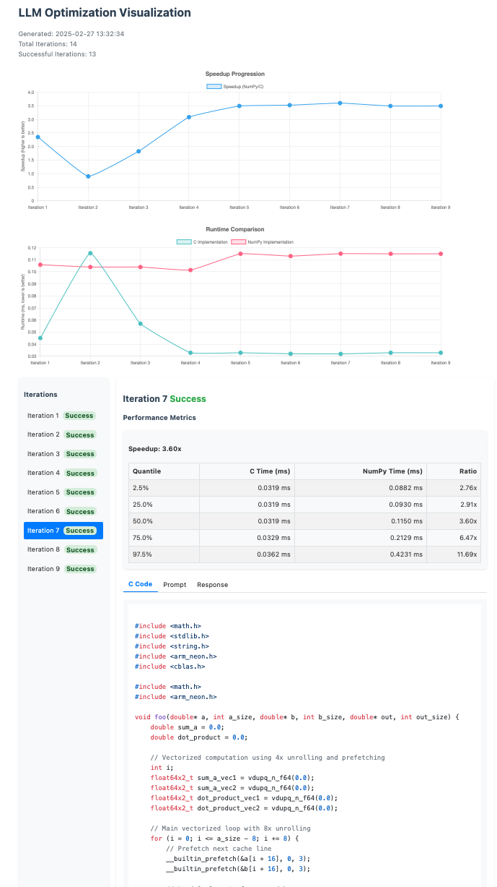

# LLM-Opt: NumPy-to-C Optimizer

This project implements a feedback loop for optimizing NumPy functions by translating them to C code using the DeepSeek API, inspired by NVIDIA's inference-time scaling approach.

## Overview

The NumPy-to-C Optimizer provides a generic approach for translating NumPy functions to optimized C implementations, effectively creating an alternative to Numba's `@jit` decorator with iterative refinement. It follows these steps:

1. Take a NumPy function as input
2. Send the NumPy function directly to DeepSeek API for C translation
3. Verify the C implementation against the original NumPy function
4. Iteratively optimize the C implementation using feedback
5. Provide a Python wrapper to call the optimized C function

This approach is generic and can be applied to any NumPy function.

## Note on cost

Working one week on this project against the DeepSeek API resulted in ~2.5M tokens over ~600 requests for a cost of $0.44. Yes, it's cheap. 

## To Do

[x] The iterations should include the test results from all previous iterations
    [ ] Maybe we can do some pruning 

[x] At each step, save the best implementation in a separate file
[x] Add platform information to the prompt
[x] If the implementation did not change, repeat the prompt
[x] Make it possible to use blas
[x] do not include code of repeated artifacts
[x] refiner should include an LLM

[ ] give up after a certain number of iterations without improvement?
[ ] it's enough to run the reference implementation only once to save time
[ ] compare the speedup with respect to the best implementation found so far instead of the reference

## Screenshot 

